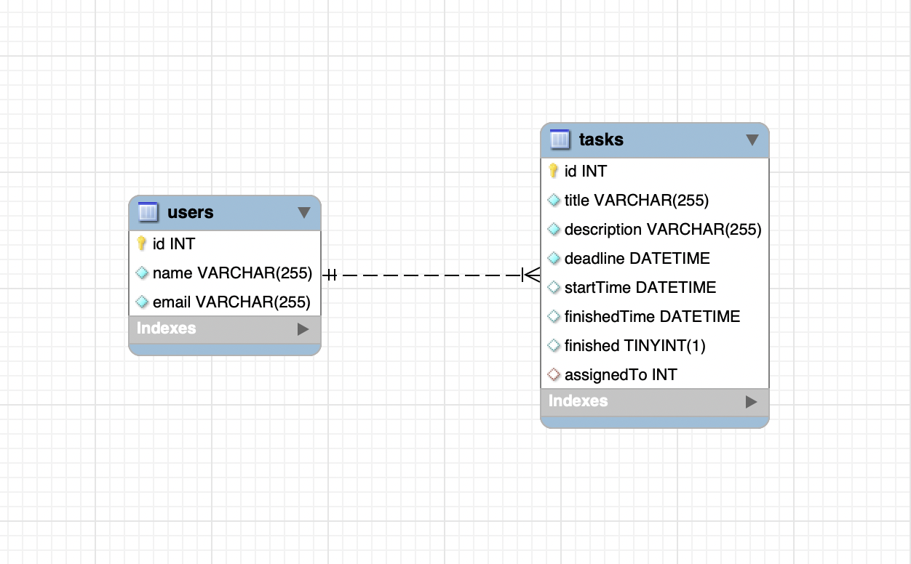
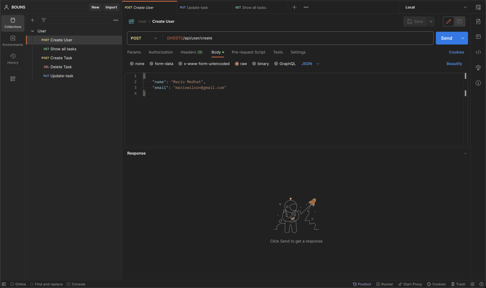
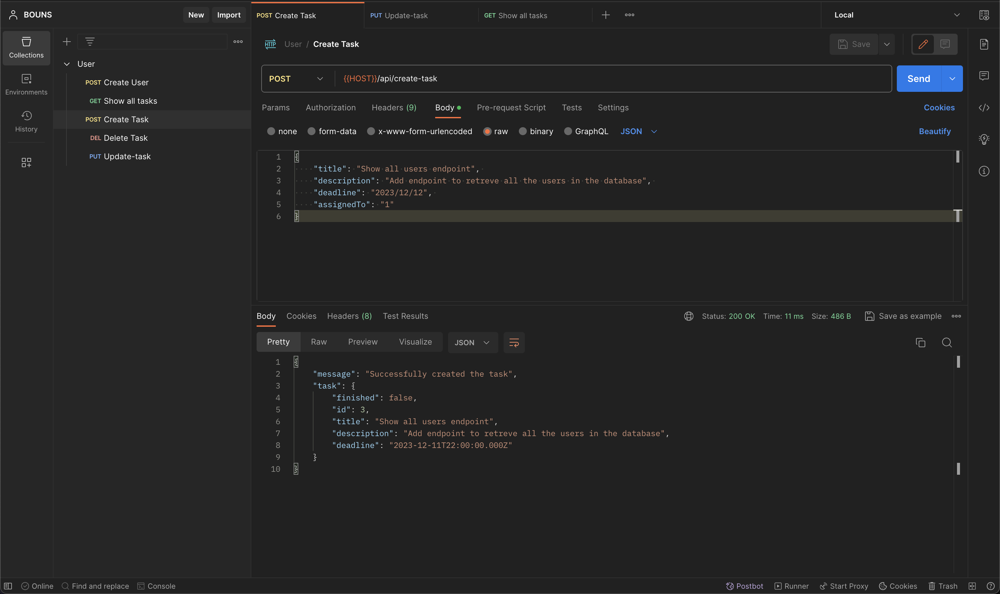
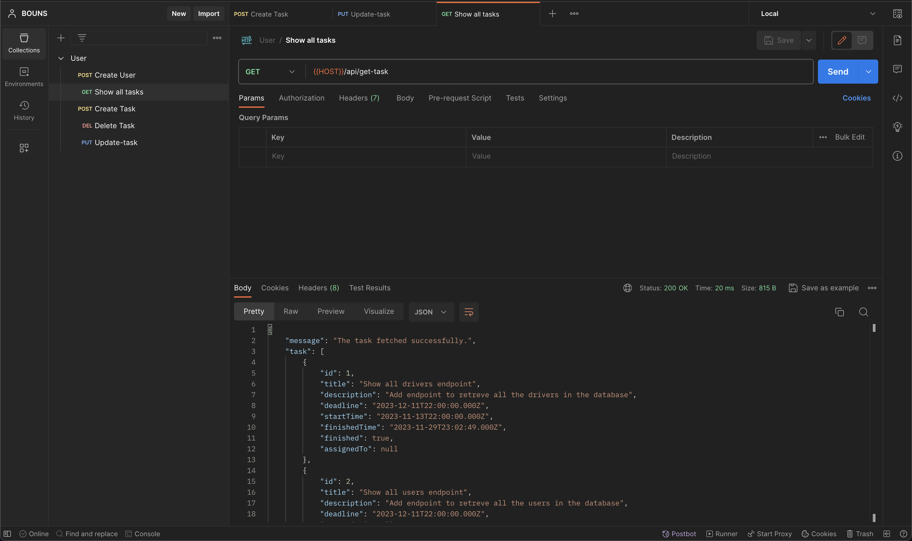
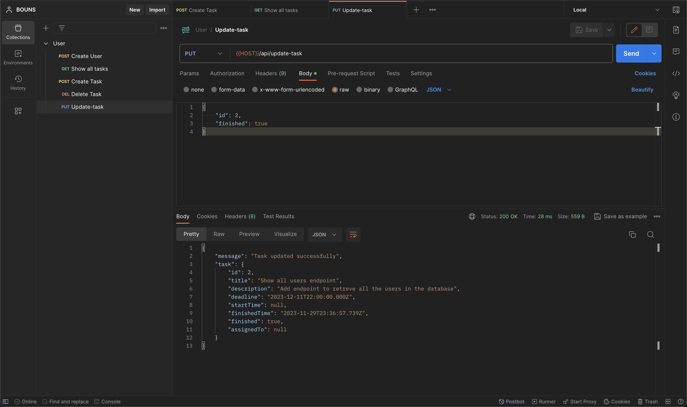
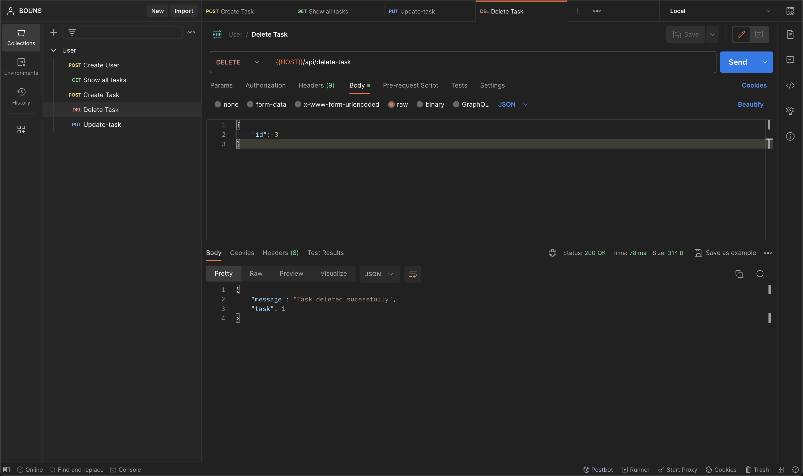

# DataEng_Bonus

A simple task assigned API for users, a Node.js-based application that allows users to set tasks for each other or be assigned tasks with deadlines. 

## Screenshot of Database

## Screenshots of requests by Postman
### Create User

### Create Task

### Show Tasks

### Update Task

### Delete Task

